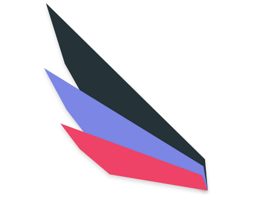
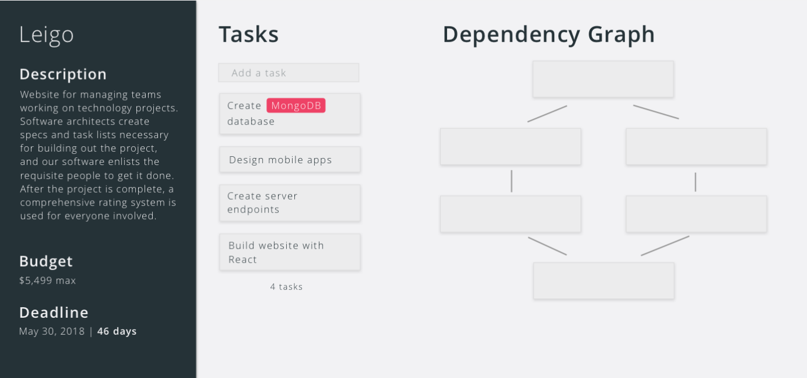

<link href="https://fonts.googleapis.com/css?family=Open+Sans" rel="stylesheet"> 
  
Leigo

-----------------------------------------

Leigo is a platform where project owners, system architects, developer, designers, and testers come together to create amazing products. With modularity and quality in mind, Leigo facilitates the sharing of development tasks among multiple developers, dictated by a contracted architects design.

## How it Works
Leigo works by allowing a project owner (i.e. someone with an idea) to easily contract out various development and technical tasks to users across the world. The steps of how this works occurs below:

1) The project owner submits a project idea, complete with title, description, and budget.

2) An architect can accept an invite to plan the technical aspects of the project, and is notified via their Leigo inbox. If accepted, they create tasks that include the technologies required for that development task, a description, as well as any documents that detail the specification. Once tasks are created, they use a drag and drop interface to indicate which tasks need to be completed first.

  

3) The architect clicks "Finished", and developers and designers get matched to development tasks. The budget is allocated between developers based on the skills required, time estimated, and previous experience. A Git repository is created for the project.

4) Each matched developer gets an invitation for the task allocated for them. If accepted, a branch is created where they can develop their task. Once completed, they link their code and also leave a note with any important considerations for their implementation.

5) Once all tasks are completed, a quality assurance user gets an invite for the project. They make sure that the code works, looks nice, and meets the requirements of the project set by the project owner. If not, they send the code back to the architecture or development phase. Otherwise, the final code is sent back to the project owner.

### Rating System
The system uses a rating system to ensure high quality of design, ideation, and implementation. Project owners are rated by the architect and quality assurer on their ability to effectively communicate ideas. Architects are rated by developers for their ability to lay out specifications. Finally, quality assurers are rated by project owners for their ability to filter out bad products. These ratings are used in an Uber-like fashion, with similar rating users being matched with other similar rating users. Additionally, the total budget will dictate the minimum rating needed to work on the project (i.e. a $1,000 budget may allow 2.5 star developers, while a $10,000 budget may only allo 4 starts and above).

### Chat System
As complications and confusion may arise through this modular process, at all times each user can chat with other users who have either 1) worked on the project, or 2) are currently working on the project. This chat is also useful for handoff situations during development.

## Technologies Used
Feel free to contribute to the project with a pull request! The platform uses NodeJS as it's backend, with a MongoDB database for holding all user and project information. The front-end is written in React, and all dependencies are bundled up using webpack.